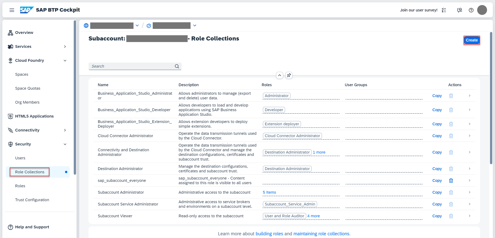
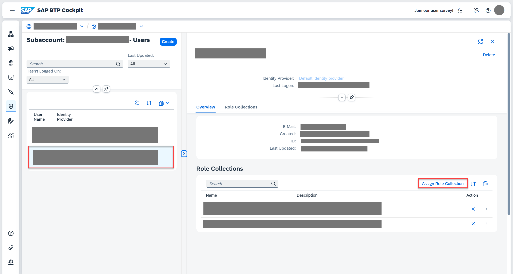

## You will learn

- How to create and assign a role collection in the SAP BTP subaccount.

## Prerequisites

- You have deployed your application in either the SAP BTP, Cloud Foundry runtime or the SAP BTP, Kyma runtime. For deploying in the SAP BTP, Cloud Foundry runtime, follow the steps in the [Deploy in SAP BTP, Cloud Foundry Runtime](deploy-to-cf) tutorial that is part of the [Deploy a Full-Stack CAP Application in SAP BTP, Cloud Foundry Runtime Following SAP BTP Developer’s Guide](https://developers.sap.com/group.deploy-full-stack-cap-application.html) tutorial group. For deploying in the SAP BTP, Kyma runtime, follow the steps in the [Deploy in SAP BTP, Kyma Runtime](deploy-to-kyma) tutorial that is part of the [Deploy a Full-Stack CAP Application in SAP BTP, Kyma Runtime Following SAP BTP Developer’s Guide](https://developers.sap.com/group.deploy-full-stack-cap-kyma-runtime.html) tutorial group.
- You have an [enterprise global account](https://help.sap.com/docs/btp/sap-business-technology-platform/getting-global-account#loiod61c2819034b48e68145c45c36acba6e) in SAP BTP. To use services for free, you can sign up for an SAP BTPEA (SAP BTP Enterprise Agreement) or a Pay-As-You-Go for SAP BTP global account and make use of the free tier services only. See [Using Free Service Plans](https://help.sap.com/docs/btp/sap-business-technology-platform/using-free-service-plans?version=Cloud).
- You have a platform user. See [User and Member Management](https://help.sap.com/docs/btp/sap-business-technology-platform/user-and-member-management).
- You are an administrator of the global account in SAP BTP.
- You have a subaccount in SAP BTP to deploy the services and applications.
- You have one of the following browsers that are supported for working in SAP Business Application Studio:
    - Mozilla Firefox
    - Google Chrome
    - Microsoft Edge

### Create a role collection and add role

1. Open the SAP BTP cockpit and navigate to your subaccount.

1. Choose **Security** &rarr; **Role Collections**, and then choose **Create**.

      <!-- border; size:540px --> 

2. In the **Create Role Collection** popup, enter **Incident Management Support** in the **Name** field and choose **Create**.

      <!-- border; size:540px --> 

3. Choose the role collection **Incident Management Support** from the list of role collections and choose **Edit** on the right.

      <!-- border; size:540px --> 

4. Open the value help in the **Role Name** field.

      <!-- border; size:540px --> 

5. Search for the role **support**, select it, and choose **Add**.

      <!-- border; size:540px --> 

6. Choose **Save**.

### Assign a role collection to a user

1. Choose **Security** &rarr; **Users**, and then choose a user from the list.

2. Under **Role Collections** on the right, choose **Assign Role Collection**.

      <!-- border; size:540px --> 

2. In the **Assign Role Collection** dialog, select the **Incident Management Support** role collection and choose **Assign Role Collection**.

      <!-- border; size:540px --> 

      You have assigned the **Incident Management Support** role collection to your user.

> You might need to log out and log back in to make sure your new role collection is taken into account.
